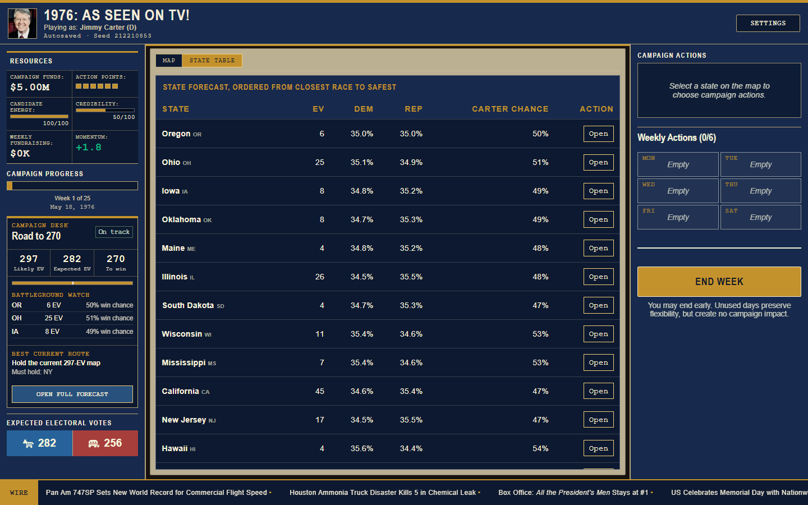
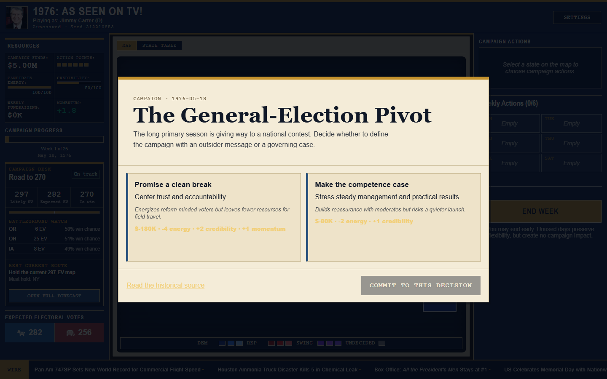

<div align="center">

# 1976: As Seen on TV!

### Carter. Ford. Twenty-five weeks. One road to 270.

[](https://github.com/aribradshaw/1976/actions/workflows/quality.yml)
[](https://github.com/aribradshaw/1976/releases/latest)
[](https://aribradshaw.github.io/1976/)

**[Play the current release](https://aribradshaw.github.io/1976/)**

</div>



1976 is a deterministic, browser-based election strategy game about the close Carter-Ford campaign. Choose a candidate, manage a finite campaign, navigate sourced historical decisions, build a route to 270, and watch every electoral vote resolve on election night.

If you play a campaign and want more historical scenarios, [star the repository](https://github.com/aribradshaw/1976) and [tell us which election to simulate next](https://github.com/aribradshaw/1976/issues/new).

The design combines the clarity of an electoral map game with the tradeoffs of a campaign-management game. Money, candidate time, credibility, field organization, ads, rallies, voter coalitions, polling uncertainty, and an opponent working under the same action ceiling all compete for attention.

## The campaign loop

1. Read the weekly briefing and historical decision.
2. Spend up to six actions across the states that matter to your route.
3. Commit the plan and resolve both campaigns together.
4. Read the newspaper recap, inspect what moved, and revise your path.
5. Survive 25 weeks and win 270 of 538 electoral votes.



## What is playable

- Carter and Ford campaigns with distinct strengths
- Easy, medium, and hard opponents using the shared action economy
- 25 sourced weekly decisions, including three presidential debates and the vice-presidential debate
- Probability-based state forecasts, expected EV, race ratings, poll confidence, must-holds, best flips, and Road to 270 paths
- Headquarters, advertising, rallies, fundraising, voter coalitions, momentum, turnout, energy, credibility, and cash flow
- Truthful plan-then-resolve weekly actions with undo before commitment
- Deterministic seeds, autosave and exact resume, and seeded 538-EV election night
- Electoral map and keyboard-operable state table
- Responsive desktop and mobile layouts, reduced motion, optional CRT effects, semantic dialogs, and visible focus

## Run locally

Requires Node.js 20.19 or newer, or Node.js 22.12 or newer.

```bash
git clone https://github.com/aribradshaw/1976.git
cd 1976
npm ci
npm run dev
```

The local game opens at `http://127.0.0.1:5173`.

## Quality gate

```bash
npm run release:verify
npm run lint
npm test
npm run build
npm run test:e2e
```

Version 2.7.8 passes 31 deterministic and unit tests plus ten Chromium journeys. Browser coverage includes setup, the 1976 network television design system, short-screen and receiver breakpoint behavior, portrait-safe candidate cards, removal of legacy music authorization state, the weekly decision and recap loop, autosave and resume, keyboard setup, persisted accessibility settings, a 390px mobile campaign, and a complete 25-week game through election night. The complete dependency tree audits cleanly.

## Architecture

- `src/components/` contains the campaign interface and accessible presentation layers.
- `src/styles/television-system.css` applies the shared 1976 network election-desk visual system.
- `src/game/simulation/` contains seeded random, canonical action quotes, forecasts, and historical-event resolution.
- `src/game/strategy/` contains deterministic Road to 270 planning.
- `src/scenarios/` contains typed scenario definitions, validation, registry, and the editable 1976 example.
- `src/data/` contains historical events, issues, state data, and voter-group inputs.
- `src/game/GameEngine.ts` remains the campaign orchestration facade while pure systems continue moving behind tested boundaries.

Read [the architecture boundary](docs/architecture.md) before changing campaign orchestration.

Interface work should also follow the [network television style guide](docs/TELEVISION_STYLE_GUIDE.md), including its palette, typography, motion, responsive, and accessibility rules.

## Build a scenario or mod

Scenario contributors do not need to learn the full engine. Start with [`HISTORICAL_1976_SCENARIO`](src/scenarios/historical1976.ts), keep state overrides sparse, add sources and contributor notes, register the scenario, and validate it against the state catalog.

The [scenario and mod guide](docs/scenarios.md) documents the schema, source requirements, tests, and current engine-integration boundary. Scenario selection in the player interface is the next planned integration step.

## Contribute

Bug fixes, historical review, accessibility improvements, tests, balance work, and well-sourced scenario proposals are welcome. Read [CONTRIBUTING.md](CONTRIBUTING.md), then choose a focused item from the [issue backlog](https://github.com/aribradshaw/1976/issues).

Useful commands:

```bash
npm test              # deterministic and unit suite
npm run test:e2e      # Chromium gameplay journeys
npm run build         # type-check and production build
npm run lint          # zero-warning lint gate
```

## Roadmap

- Integrate scenario selection and portable scenario import/export
- Extract additional week-resolution phases from `GameEngine` into pure simulation modules
- Add advisor-led first-week onboarding
- Expand historical scenarios and community-authored event decks
- Complete a redistributable audio replacement pass

## Historical sources and asset rights

The simulation separates documented historical context from modeled gameplay effects. Core election and debate material is sourced from the [National Archives 1976 Electoral College results](https://www.archives.gov/electoral-college/1976) and the [American Presidency Project debate archive](https://www.presidency.ucsb.edu/documents/presidential-campaign-debate-1). Individual historical decisions include their own source links in `src/data/events1976.ts`.

The original source code and documentation in this repository are licensed under the [MIT License](LICENSE). The Carter and Ford portraits are verified United States federal government works in the public domain. Bundled audio remains excluded from the code license because its redistribution terms are separate; see the [asset rights inventory](docs/ASSET_RIGHTS.md) for the current status and contribution rules.

## Release history

The project follows its Arizona-calendar release policy: each live push advances the patch, a new month advances the minor, and a new year advances the major. See [DEVLOG.md](DEVLOG.md) and [GitHub Releases](https://github.com/aribradshaw/1976/releases).
